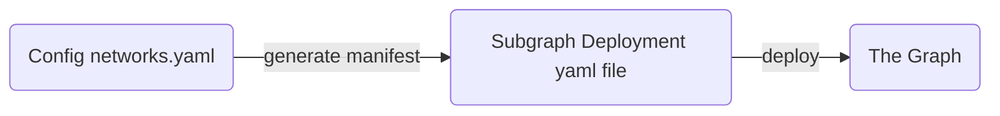

# Giveth Economy Subgraph

## 1. Project Overview

### Purpose
The Giveth Economy Subgraph is a Graph Protocol subgraph that is built for the Giveth Economy smart contracts. It is used to index and make queryable the Giveth Economy smart contracts.

### Key Features
- Supports GIVeconomy DeFi protocol variety of balances, e.g. GIV Power, GIV Token Lock, GIV Merkle Distro, GIV Uniswap V3 Liquidity Mining, Givers PFP, etc.
- Provides historical snapshots of GIV Power
- Provides GIVPower locked positions information, e.g. amount, unlocked, unlockable at,...
- Automatic indexing config generation using handlebars templates

### Live Links
- Mainnet Subgraph: https://thegraph.com/hosted-service/subgraph/giveth/giveth-economy-second-mainnet
- Gnosis Chain Subgraph: https://thegraph.com/hosted-service/subgraph/giveth/giveth-economy-second-xdai

## 2. System Architecture

### Flow Diagram


### Tech Stack
- Graph Protocol
- TypeScript/AssemblyScript
- GraphQL
- Handlebars

### Data Flow
1. Smart contracts emit events
2. Subgraph event handlers process these events
3. Data is stored in entities according to the schema
4. GraphQL API provides query access to the indexed data

## 3. Getting Started

### Prerequisites
- Node.js (v14 or higher)
- NPM or Yarn package manager
- Access to The Graph hosted service

### Installation Steps
1. Clone the repository:
```bash
git clone https://github.com/Giveth/giveconomy-subgraph.git
cd giveconomy-subgraph
```

2. Install dependencies:
```bash
yarn install
```

3. Authenticate with The Graph:
```bash
yarn auth
```

### Configuration
The subgraph configuration is managed through:
- `subgraph.template.yaml`: Template for subgraph configuration. No need to write manually if you use the networks.yaml file and the generate-manifests command.
- `networks.yaml`: A template to configure contract addresses and start blocks for each network. This will be processed by the generate-manifests command to create the subgraph deployment yaml file.

## 4. Usage Instructions

### Running the Application
To build and deploy the subgraph:

1. Update the networks.yaml file with the correct contract addresses and start blocks for each network.

2. Build: This will generate the subgraph deployment yaml file and subgraph code.
```bash
yarn build
```

3. Deploy to specific network: 
```bash
# For Gnosis Chain
yarn deploy:gnosis:production

# For Mainnet
yarn deploy:mainnet:production
```
Look at the corresponding scripts in the package.json to customize it for new networks.

### Testing
The subgraph includes linting and type checking:
```bash
yarn lint
```

### Build Issues
Test type and build issues with build command.
```bash
yarn build
```

## 5. Deployment Process

### Deployment Steps
1. Update contract addresses in `networks.yaml` if needed
2. Generate manifests with updated configurations
3. Build the subgraph
4. Deploy to the appropriate environment

### CI/CD Integration
Deployments are managed through GitHub Actions in the `.github/workflows` directory.

## 6. Troubleshooting

### Common Issues
1. **Deployment Failures**
   - Check network configuration in `networks.yaml`
   - Verify contract addresses and start blocks
   - Ensure proper authentication with The Graph
   - Check the graph hosted service accessability

2. **Query Errors**
   - Verify entity schema matches the GraphQL schema
   - Check subgraph health, i.e. sync status, indexing status, etc.

### Logs and Debugging
- Use Graph Protocol's dashboard to monitor indexing status
- Check deployment logs in The Graph's hosted service
- Monitor subgraph health through GraphQL queries, e.g. block number,...
- Unreliable subgraph results due to malfunctioning subgraph nodes

## Schema Documentation

The subgraph defines several key entities:

### Core Entities
- `GIVPower`: Tracks overall GIV Power balances
- `ERC20`: Tracks ERC20 token balances, i.e. simple tokens and LP tokens
- `TokenLock`: Records individual token locks
- `User`: Manages user balances and relationships
- `Unipool`: Tracks liquidity pool information
- `TokenDistro`: Manages token distribution parameters

### Uniswap V3 Entities
- `UniswapPosition`: Tracks liquidity positions
- `UniswapV3Pool`: Records pool state
- `UniswapInfinitePosition`: Manages infinite positions

### Additional Entities
- `TokenBalance`: User token balances
- `UnipoolBalance`: User pool balances
- `TokenAllocation`: Token distribution records
- `GiversPFPToken`: Givers PFP token information

For detailed schema information, refer to `schema.graphql`.
