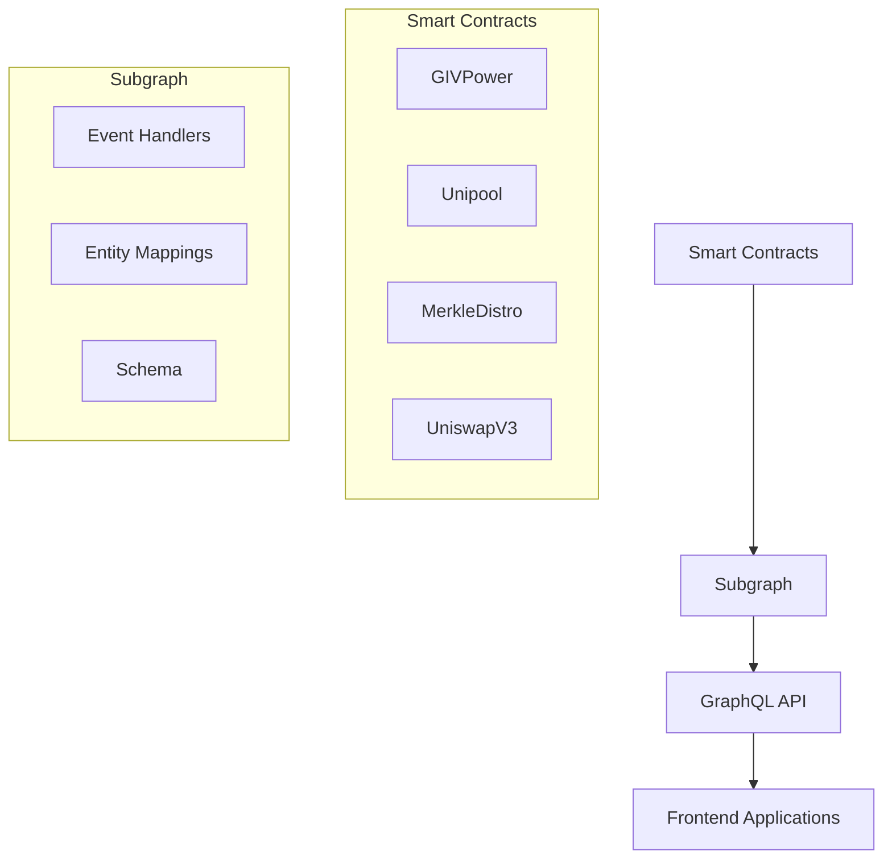

# Giveth Economy Subgraph

## 1. Project Overview

### Purpose
The Giveth Economy Subgraph is a Graph Protocol subgraph that indexes and makes queryable the Giveth Economy smart contracts. It provides a way to efficiently query blockchain data related to GIV token locking, staking, rewards distribution, and Uniswap V3 integration.

### Key Features
- Tracks GIV token locking and unlocking events
- Monitors Uniswap V3 liquidity positions and staking
- Records token distributions and allocations
- Tracks user balances and rewards across different pools
- Provides historical snapshots of GIV Power

### Live Links
- Mainnet Subgraph: https://thegraph.com/hosted-service/subgraph/giveth/giveth-economy-second-mainnet
- Gnosis Chain Subgraph: https://thegraph.com/hosted-service/subgraph/giveth/giveth-economy-second-xdai

## 2. Architecture Overview

### System Diagram


### Tech Stack
- Graph Protocol
- TypeScript/AssemblyScript
- GraphQL
- Ethereum/Gnosis Chain

### Data Flow
1. Smart contracts emit events
2. Subgraph event handlers process these events
3. Data is stored in entities according to the schema
4. GraphQL API provides query access to the indexed data

## 3. Getting Started

### Prerequisites
- Node.js (v14 or higher)
- Yarn package manager
- Graph CLI (`npm install -g @graphprotocol/graph-cli`)
- Access to The Graph hosted service

### Installation Steps
1. Clone the repository:
```bash
git clone https://github.com/Giveth/giveconomy-subgraph.git
cd giveconomy-subgraph
```

2. Install dependencies:
```bash
yarn install
```

3. Authenticate with The Graph:
```bash
yarn auth
```

### Configuration
The subgraph configuration is managed through:
- `subgraph.template.yaml`: Template for subgraph configuration
- `networks.yaml`: Network-specific contract addresses and configurations
- Environment variables for deployment keys

## 4. Usage Instructions

### Running the Application
To build and deploy the subgraph:

1. Generate manifests:
```bash
yarn generate-manifests
```

2. Build the subgraph:
```bash
yarn build
```

3. Deploy to specific network:
```bash
# For Gnosis Chain
yarn deploy:gnosis:production

# For Mainnet
yarn deploy:mainnet:production
```

### Testing
The subgraph includes linting and type checking:
```bash
yarn lint
```

### Common Tasks
- Generate TypeScript types:
```bash
yarn codegen:deployment-7
```

- Build specific deployment:
```bash
yarn build:deployment-7
```

## 5. Deployment Process

### Environments
- Production (Mainnet & Gnosis Chain)
- Staging (Various test networks)
- Development (Local development)

### Deployment Steps
1. Update contract addresses in `networks.yaml` if needed
2. Generate manifests with updated configurations
3. Build the subgraph
4. Deploy to the appropriate environment

### CI/CD Integration
Deployments are managed through GitHub Actions in the `.github/workflows` directory.

## 6. Troubleshooting

### Common Issues
1. **Deployment Failures**
   - Check network configuration in `networks.yaml`
   - Verify contract addresses and start blocks
   - Ensure proper authentication with The Graph

2. **Query Errors**
   - Verify entity schema matches the GraphQL schema
   - Check event handler implementations
   - Ensure proper indexing of events

### Logs and Debugging
- Use Graph Protocol's dashboard to monitor indexing status
- Check deployment logs in The Graph's hosted service
- Monitor subgraph health through GraphQL queries

## Schema Documentation

The subgraph defines several key entities:

### Core Entities
- `GIVPower`: Tracks overall GIV Power statistics
- `TokenLock`: Records individual token locks
- `User`: Manages user balances and relationships
- `Unipool`: Tracks liquidity pool information
- `TokenDistro`: Manages token distribution parameters

### Uniswap V3 Entities
- `UniswapPosition`: Tracks liquidity positions
- `UniswapV3Pool`: Records pool state
- `UniswapInfinitePosition`: Manages infinite positions

### Additional Entities
- `TokenBalance`: User token balances
- `UnipoolBalance`: User pool balances
- `TokenAllocation`: Token distribution records
- `GiversPFPToken`: Givers PFP token information

For detailed schema information, refer to `schema.graphql`.
